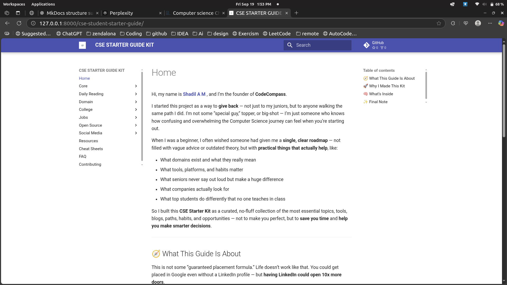
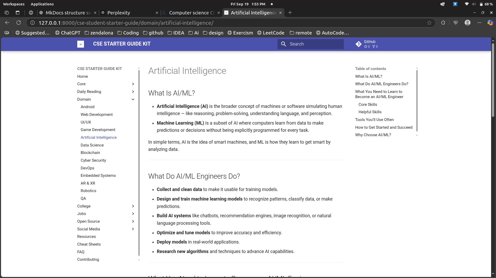
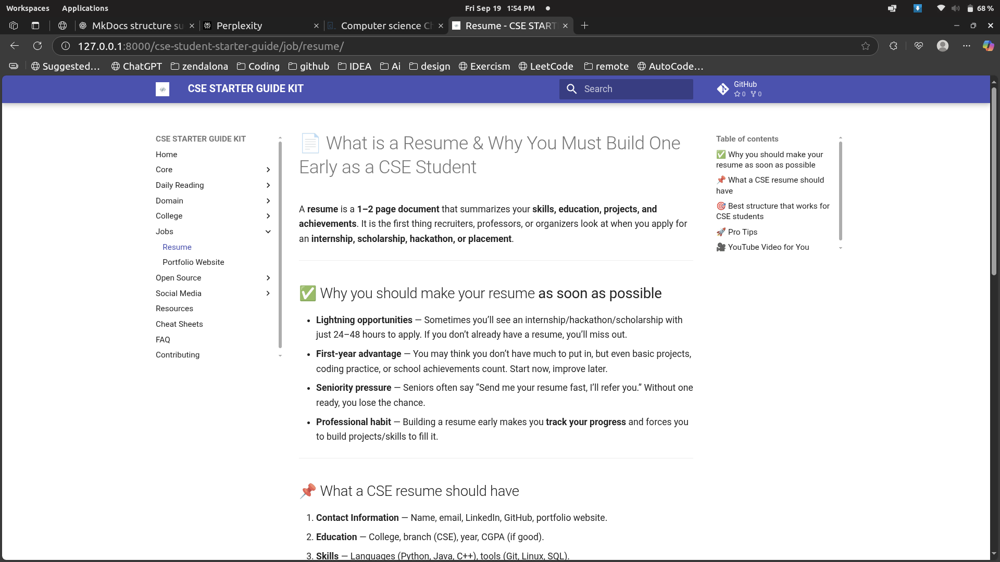

# 🚀 CSE Starter Guide Kit


**CSE Starter Guide Kit** is a curated, beginner-friendly guide and resources kit for computer science students to learn core concepts, domains, tools, and career essentials.

---

## 🎯 Table of Contents
- [🚀 CSE Starter Guide Kit](#-cse-starter-guide-kit)
  - [🎯 Table of Contents](#-table-of-contents)
  - [📝 About](#-about)
  - [✨ Features](#-features)
  - [🚀 Getting Started](#-getting-started)
  - [📂 Folder Structure](#-folder-structure)
  - [🖼 Screenshots](#-screenshots)
  - [🎬 Demo](#-demo)
  - [🤝 Contributing](#-contributing)
  - [📚 Resources](#-resources)
  - [📜 License](#-license)
  - [📬 Contact](#-contact)

---

## 📝 About

This guide is built for **college-level CSE students** who want a structured roadmap from fundamentals to domain exploration, daily reading habits, and career preparation.  
It covers:

- Programming languages & tools  
- Linux, Git, GitHub, and productivity tips  
- Domains like AI, Web Development, Game Development, Embedded Systems  
- College life hacks, hackathons, placements, scholarships  
- Open-source participation & social media guidance  

---

## ✨ Features

- Beginner-friendly & structured for easy navigation  
- Multi-domain coverage (Android, AI, Web, Blockchain, DevOps, etc.)  
- Career guidance (resume, portfolio, hackathons)  
- Open-source programs and contribution guides  
- Cheat sheets, resources, and FAQs  
- Offline-ready MkDocs website

---

## 🚀 Getting Started

**1. Clone the repository**
```bash
git clone https://github.com/shadil-rayyan/cse-student-starter-guide.git
cd cse-student-starter-guide
````

**2. Install dependencies**

```bash
pip install mkdocs-material mkdocs-minify-plugin mkdocs-awesome-pages-plugin mkdocs-macros-plugin mkdocs-codeinclude-plugin
```

**3. Serve locally**

```bash
mkdocs serve
```

**4. Build for GitHub Pages**

```bash
mkdocs build
mkdocs gh-deploy
```

---

## 📂 Folder Structure

```
├── assets
│   └── logo.png
├── college
├── core
├── daily-reading
├── domain
├── job
├── open-source
├── social-media
├── index.md
├── about.md
├── resources.md
├── cheatsheet.md
├── faq.md
└── contributing.md
```

---

## 🖼 Screenshots

**Home Page**



**Domain Section**



**Job & Resume Section**



---

## 🎬 Demo

Live site: [https://shadil-rayyan.github.io/cse-student-starter-guide/](https://shadil-rayyan.github.io/cse-student-starter-guide/)

* Interactive sidebar navigation
* Search and instant navigation
* Inline code copy and cheat sheets
* Fully responsive and mobile-friendly

---

## 🤝 Contributing

Contributions are welcome! See [contributing.md](contributing.md) for guidelines.
Steps: Fork → Branch → Commit → Pull Request

---

## 📚 Resources

Check [resources.md](resources.md) for curated books, websites, courses, and tools to accelerate your CSE journey.

---

## 📜 License

This project is licensed under the [MIT License](LICENSE).

---

## 📬 Contact

* LinkedIn: [Shadil AM](https://www.linkedin.com/in/shadil-am/)
* GitHub: [shadil-rayyan](https://github.com/shadil-rayyan)
* Email: [your-email@example.com](mailto:codecompass2024@gmail.com)
